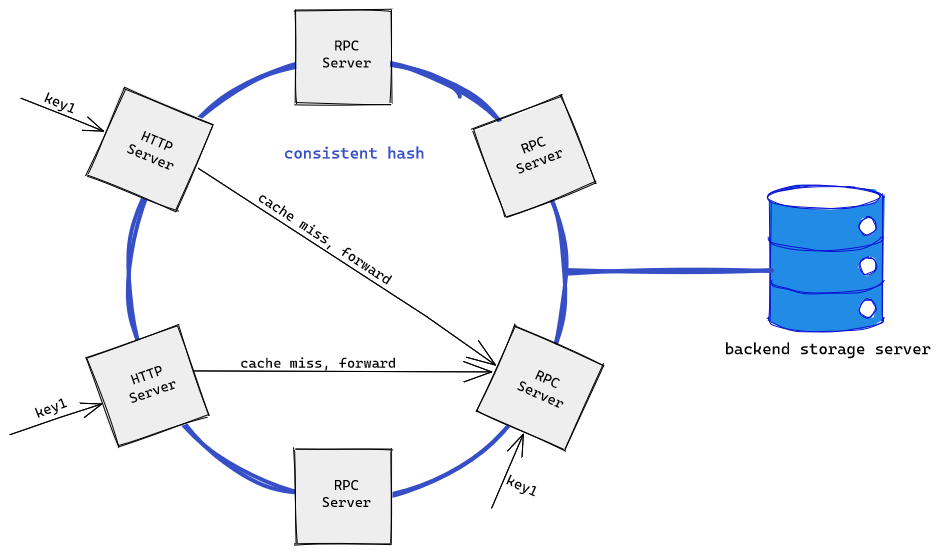

## staticcache

`staticcache` is a distributed static resources cache by go.

## overview



- cache servers are organized by consistent hash algorithm. They can be seen as remote servers for each other.
- The query will be forwarded to another server picked by consistent hash algorithm when the local server cache miss.
- Local server will try to fetch data from the backend storage server, when the picked remote server response none.
- The local server itself will also be picked, as it is in the hash ring as well. When itself was picked, the query will not be forwarded, and the data will try to be fetched from the backend storage server.
- `HTTP` or `RPC` is used to receive requests and response results. You can define your own server which implements `CacheServer` interface with any protocol.

## Demo

start  some `HTTPServer`/`RPCServer` at `localhost:8xxx` and use consistent hash organize servers:

```bash
go run main.go -local="[http]localhost:8000" -servers="[http]localhost:8001,[rpc]localhost:8002"
go run main.go -local="[http]localhost:8001" -servers="[http]localhost:8000,[rpc]localhost:8002"
go run main.go -local="[rpc]localhost:8002" -servers="[http]localhost:8000,[http]localhost:8001"
```

```go
package main

import (
    "flag"
    "fmt"
    "github.com/YuHover/staticcache"
    "github.com/YuHover/staticcache/server"
    "log"
    "net"
    "net/http"
    "net/rpc"
    "strings"
)

func main() {
    var local string
    var servers string
    flag.StringVar(&local, "local", "", "[schema]ip:port")
    flag.StringVar(&servers, "servers", "", "[schema]ip:port,[schema]ip:port,...")
    flag.Parse()
    
    // parse arguments and new appropriate server
    var localServer staticcache.CacheServer
    localHttp := strings.HasPrefix(local, "[http]")
    localAddr := strings.TrimPrefix(strings.TrimPrefix(local, "[http]"), "[rpc]")
    if localHttp {
        localServer = server.NewHTTPServer(localAddr)
    } else {
        localServer = server.NewRPCServer(localAddr)
    }
    
    // parse arguments and new appropriate server
    var cacheServers []staticcache.CacheServer
    ss := strings.Split(servers, ",")
    for _, s := range ss {
        log.Printf(s)
        if strings.HasPrefix(s, "[http]") {
            address := strings.TrimPrefix(s, "[http]")
            cacheServers = append(cacheServers, server.NewHTTPServer(address))
        } else {
            address := strings.TrimPrefix(s, "[rpc]")
            cacheServers = append(cacheServers, server.NewRPCServer(address))
        }
    }

    // use consistent hash organize servers
    picker := staticcache.NewConsistentPicker(staticcache.WithReplicas(100))
    picker.SetServers(localServer, cacheServers...)
    
    pseudoDB := map[string]string{"1": "1", "2": "2", "3": "3", "4": "4", "5": "5", "6": "6"}
    // new a StaticCache instance
    sc := staticcache.NewStaticCache("digits", 1<<10, staticcache.GetterFunc(func(key string) ([]byte, error) {
        if v, ok := pseudoDB[key]; ok {
            return []byte(v), nil
        }
        return nil, fmt.Errorf("%s does not exist in the pseudoDB", key)
    }))
    sc.SetConsistentPicker(picker)

    // LocalServer receive query for object.
    // LocalServer checks its own cache (above sc),
    // If cache miss, the query will be forwarded to another server picked by consistent hash.
    // If the picked server doesn't have the data, data will be fetched from pseudoDB.
    if localHttp {
        http.ListenAndServe(localAddr, localServer.(*server.HTTPServer))
    } else {
        err := rpc.RegisterName(localAddr, localServer.(*server.RPCServer)) // address as name
        if err != nil {
            log.Fatalf("rpc register [%s] error: %v", localAddr, err)
        }

        listen, err := net.Listen("tcp", localAddr)
        if err != nil {
            log.Fatalf("listen [%s] error: %v", localAddr, err)
        }

        for {
            conn, err := listen.Accept()
            if err != nil {
                log.Printf("accept error: %v", err)
                continue
            }
            go rpc.ServeConn(conn)
        }
    }
}
```

## Note

- cached static resources only can be populated by backend storage server.
- cached static resources only can be deleted by built-in LRU replacement policy.

- `staticcache` focus on caching static resources which are immutable.